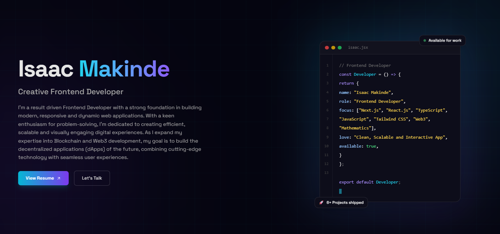

# Isaac Makinde - Personal Portfolio Website

Welcome to my personal portfolio! This project showcases my frontend development skills and projects I've worked on. Feel free to explore the different sections to learn more about me and my work.

## Technologies Used

- React.js: A popular JavaScript library for building user interfaces.
- Tailwind CSS: A utility-first CSS framework for rapidly styling web applications.
- Framer Motion: A motion library for creating smooth animations and transitions.
- React Icons: A library providing a wide range of icons for your projects.

## Features

- Responsive design: The portfolio is fully responsive to ensure a seamless experience on different devices.
- Smooth animations: Framer Motion is used to add elegant animations and transitions.
- Project showcase: A dedicated section to showcase my projects with descriptions and links.
- Contact information: Users can easily get in touch with me through provided contact details.

## Installation and Setup

1.  Fork
2.  Clone the forked repository to your local machine using `git clone`.
3.  Navigate to the project directory: `cd isaacmakinde`.
4.  Install project dependencies using `npm install`.
5.  Start the development server: `npm run dev`.
6.  Open your web browser and navigate to `http://localhost:5173` to view the portfolio.

## Usage

Feel free to customize this portfolio to showcase your own projects and skills. Update the project descriptions, images, and links to match your work. Shout out is important too.

## Contact

If you have any questions or would like to get in touch, you can reach me at:

- Email: ismakinde@gmail.com
- Linkedin: [Isaac Makinde](https://www.linkedin.com/in/isaacmakinde/)
- X (Formerly Twitter): [isaacmakinde](https://twitter.com/isaacmakinde_)
- GitHub: [Oluwa-Laughter](https://github.com/Oluwa-Laughter)
- Portfolio: [Isaac Makinde](https://isaacmakinde.vercel.app)
